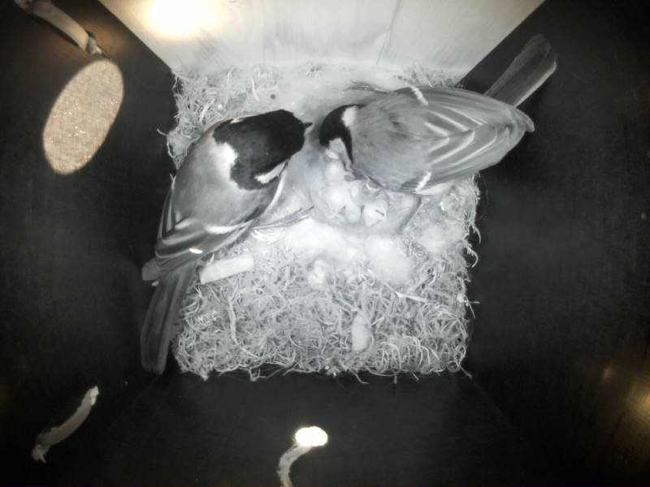

# Birdbox Website

Spring Boot website for our birdbox: a livestream from the camera inside, plus temperature and humidity sensor readings.

🔗 Live site: [https://birdbox.home.mabaka.ch/](https://birdbox.home.mabaka.ch/)

## Guests in spring 2026

A pair of Blue Tits (Blaumeisen) moved into the birdbox in spring 2026 and successfully raised 5 baby birds.

## License

See [LICENSE.md](LICENSE.md).
